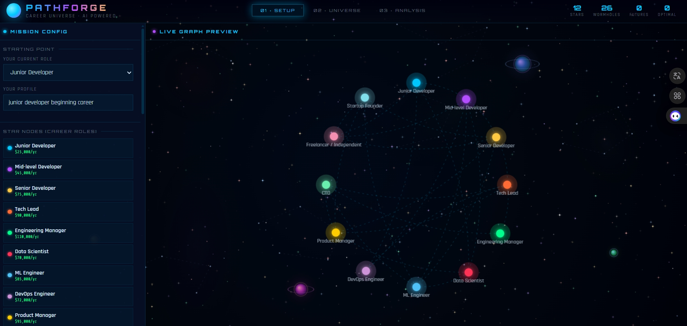
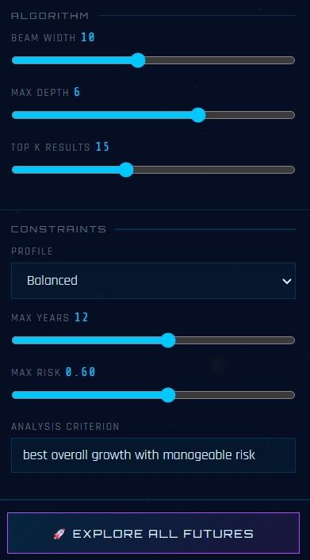
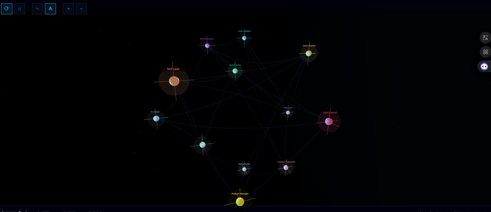
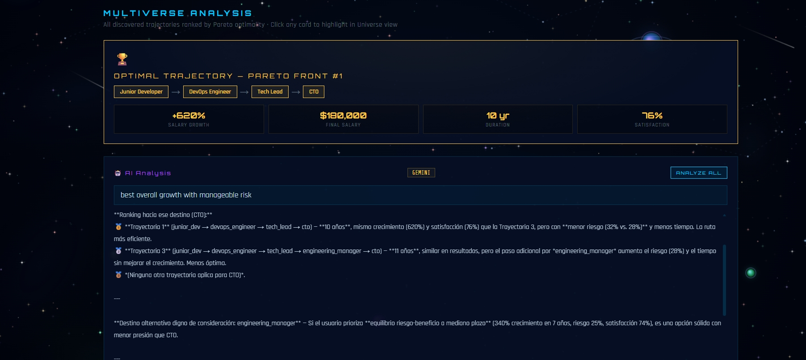
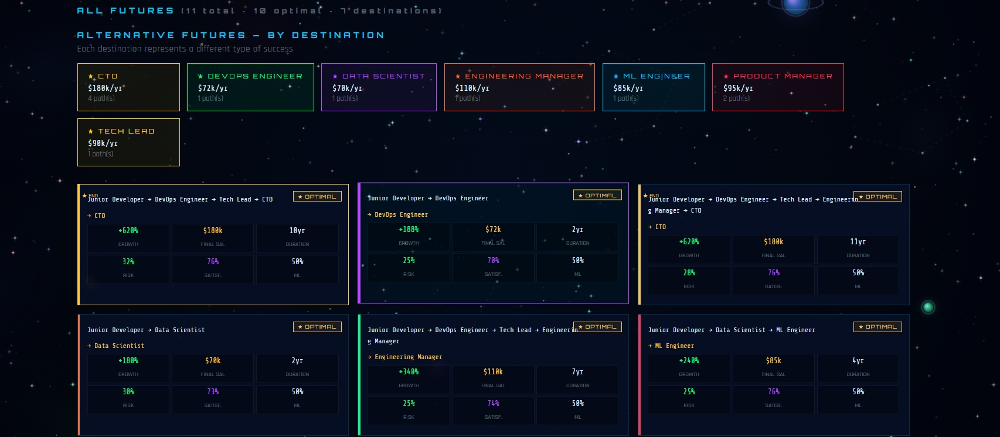

<div align="center">

<br>


<br>

# 🔮 PathForge

### **Career Universe Explorer — AI-Powered Professional Trajectory Optimization**

[](https://python.org)
[](https://fastapi.tiangolo.com)
[](https://threejs.org)
[](https://scikit-learn.org)
[](LICENSE)

**PathForge** es un motor inteligente de exploración de trayectorias profesionales que combina **Beam Search multiobjetivo**, **dominancia de Pareto (NSGA-II vectorizado)**, **restricciones de satisfacción**, **simulación estocástica Monte Carlo** y **Modelos de Lenguaje (LLM)** para generar, evaluar y analizar trayectorias profesionales alternativas bajo distintos objetivos y restricciones del mundo real.

> *Proyecto Final de Inteligencia Artificial — Universidad de La Habana*
> *Facultad de Matemática y Computación · Curso 2025–2026 · Grupo C-311*

<br>

</div>

---

## 📋 Tabla de Contenidos

- [🎯 Descripción del Problema](#-descripción-del-problema)
- [✨ Características Principales](#-características-principales)
- [🖥️ Interfaz Gráfica](#️-interfaz-gráfica)
- [🏛️ Arquitectura del Sistema](#️-arquitectura-del-sistema)
- [🚀 Instalación y Primeros Pasos](#-instalación-y-primeros-pasos)
- [🔑 Configuración del LLM](#-configuración-del-llm)
- [▶️ Guía Completa de Comandos](#️-guía-completa-de-comandos)
  - [`python main.py train`](#-python-mainpy-train)
  - [`python main.py server`](#-python-mainpy-server)
  - [`python main.py run`](#-python-mainpy-run)
  - [`python main.py input`](#-python-mainpy-input)
- [🧪 Experimentos](#-experimentos)
  - [Ejecución de Experimentos](#ejecución-de-experimentos)
  - [Visualización de Resultados](#visualización-de-resultados)
  - [Configuraciones Comparadas](#configuraciones-comparadas)
  - [Métricas Medidas](#métricas-medidas)
- [📊 Dataset](#-dataset)
- [🤖 Rol del LLM](#-rol-del-llm)
- [📁 Estructura del Proyecto](#-estructura-del-proyecto)
- [🧪 Tests y Verificación](#-tests-y-verificación)
---

## 🎯 Descripción del Problema

**Tema 7 — Exploración de trayectorias profesionales alternativas**

Dado un conjunto de decisiones posibles en una carrera profesional, PathForge genera y evalúa múltiples trayectorias válidas bajo distintos criterios simultáneos:

| Objetivo | Tipo | Descripción |
|:---|:---|:---|
| `salary_growth` | Maximizar | Crecimiento salarial total de la trayectoria |
| `final_salary` | Maximizar | Salario del rol final alcanzado |
| `avg_demand` | Maximizar | Demanda laboral promedio de los roles |
| `avg_satisfaction` | Maximizar | Satisfacción profesional media |
| `total_years` | Minimizar | Años totales de la trayectoria |
| `avg_risk` | Minimizar | Riesgo promedio de las transiciones |
| `avg_difficulty` | Minimizar | Dificultad media de los cambios de rol |

El sistema utiliza **dominancia de Pareto (NSGA-II vectorizado)** para encontrar trayectorias no dominadas — aquellas donde no existe ninguna alternativa mejor en todos los objetivos simultáneamente — y un **LLM** para análisis cualitativo y ranking por criterio en lenguaje natural.

---

## ✨ Características Principales

<table>
<tr>
<td width="50%">

### 🧠 Núcleo Algorítmico
- **Beam Search** con poda por restricciones y selección por Pareto
- **NSGA-II vectorizado** con numpy para clasificación no dominada
- **Simulación Monte Carlo** con eventos estocásticos (Welford online)
- **GradientBoosting** (sklearn) para predicción de éxito de transiciones
- **5 restricciones compuestas** con operadores AND/OR

</td>
<td width="50%">

### 🤖 Integración LLM
- **7 proveedores**: Gemini, Claude, OpenAI, Groq, DeepSeek, Mistral, OpenRouter
- **Cola circular** de API keys con fallback automático
- **Backoff exponencial** (60s → 120s → 240s → máx 600s)
- **Thread-safe** para requests concurrentes
- **3 modos de análisis**: comparación, ranking por criterio, destinos alternativos

</td>
</tr>
<tr>
<td width="50%">

### 🌐 Interfaz Visual
- **Universo 3D interactivo** (Three.js) con nodos como estrellas
- **Animación en tiempo real** del Beam Search vía WebSocket
- **3 vistas**: Setup → Universe 3D → Analysis
- **Fondo espacial** animado con nebulas y estrellas fugaces
- **Grafo vacío o preseleccionado** según modo de inicio

</td>
<td width="50%">

### 📊 Experimentación
- **240 combinaciones** experimentales (20 dominios × 4 configs × 3 perfiles)
- **3 figuras de análisis** generadas automáticamente
- **20 dominios profesionales** desde datos reales
- **Dataset Karrierewege_plus** (80,000 trayectorias reales)
- **CLI completo** con `--domain`, `--no-llm`, `--quick`

</td>
</tr>
</table>

---

## 🖥️ Interfaz Gráfica

PathForge cuenta con una interfaz web inmersiva de tema espacial cyberpunk con tres vistas principales:

### Vista Setup — Configuración del Universo

<p align="center">

</p>

<p align="center">

</p>

Configura nodos de inicio, perfiles de restricciones, beam_width, max_depth, y selecciona dominios profesionales — todo desde una interfaz visual intuitiva.

### Vista Universe 3D — Exploración Interactiva

<p align="center">

</p>

Las trayectorias se visualizan como conexiones entre estrellas en un universo 3D interactivo. El Beam Search se anima en tiempo real mediante WebSocket, mostrando cada paso de la exploración.

### Vista Analysis — Resultados y Análisis LLM

<p align="center">

</p>

Muestra las trayectorias generadas con métricas detalladas, rankings de Pareto, y el análisis cualitativo del LLM con recomendaciones personalizadas.

<p align="center">

</p>

---

## 🏛️ Arquitectura del Sistema

```
PathForge/
│
├── backend/
│   ├── core/               ← Núcleo algorítmico
│   │   ├── graph.py        # CareerGraph: abstracción del grafo + scoring multiobjetivo
│   │   ├── generator.py    # Beam Search multiobjetivo con poda por restricciones
│   │   ├── evaluator.py    # NSGA-II vectorizado con numpy + crowding distance
│   │   ├── constraints.py  # Sistema de restricciones componible (AND/OR)
│   │   ├── scorer.py       # GradientBoosting ML para scoring de transiciones
│   │   └── simulation.py   # Monte Carlo con eventos estocásticos (Welford online)
│   │
│   ├── data/               ← Gestión de datos
│   │   ├── loader.py       # Carga y validación del grafo (Pydantic v2)
│   │   ├── careers.json    # Grafo default (12 roles tech, 26 transiciones)
│   │   ├── input_manager.py# CRUD de configuraciones usuario (SQLite)
│   │   ├── download_data.py# Descarga dataset Karrierewege_plus de HuggingFace
│   │   ├── transform_data.py# Transforma CSV → domain graphs por sector ISCO-08
│   │   └── problems/       # Domain graphs generados (20 dominios)
│   │
│   ├── llm/                ← Integración LLM
│   │   ├── client.py       # Cliente multi-proveedor (7 LLMs) con cola circular
│   │   ├── analyzer.py     # Análisis cualitativo sync + async
│   │   └── prompts.py      # Prompts en inglés, respuesta en español
│   │
│   ├── experiments/        ← Diseño experimental
│   │   ├── metrics.py      # Métricas del algoritmo (diversidad vectorizada)
│   │   ├── runner.py       # Runner con --domain y --instances
│   │   ├── run_experiments.py # Experimento con --domain, --no-llm, --quick
│   │   ├── run_all_domains.py # Itera automáticamente sobre todos los dominios
│   │   ├── visualizer.py   # 3 figuras matplotlib del análisis experimental
│   │   └── results/        # Generado automáticamente
│   │
│   ├── tests/              ← Suite de tests (71 tests)
│   │
│   └── main_api.py         ← FastAPI + WebSocket (lifespan, async endpoints)
│
├── frontend/               ← Interfaz visual
│   ├── index.html          # SPA con 3 vistas: Setup / Universe 3D / Analysis
│   ├── css/style.css       # Tema espacial cyberpunk
│   └── js/
│       ├── universe.js     # Fondo espacial 2D animado (SpaceBG)
│       ├── graph3d.js      # Universo 3D interactivo (Three.js)
│       ├── animation.js    # Animaciones del beam search en tiempo real
│       ├── websocket.js    # API REST + WebSocket con heartbeat
│       └── ui.js           # Estado global + gestión de vistas
│
├── main.py                 ← CLI principal (train, server, run, input)
├── quick_test.py           ← Test rápido sin pytest
├── verify_installation.py  ← Verificación completa del entorno
├── .env.example            ← Plantilla de configuración LLM
└── requirements.txt        ← Dependencias Python
```

---

## 🚀 Instalación y Primeros Pasos

### Requisitos

| Requisito | Versión | Nota |
|:---|:---|:---|
| Python | 3.10+ | Obligatorio |
| pip | Última | Gestor de paquetes |
| Git | Cualquiera | Para clonar el repositorio |

### Paso 1 — Clonar e instalar dependencias

```bash
git clone https://github.com/JosuSC/PathForge.git
cd PathForge
pip install -r requirements.txt
```

### Paso 2 — Verificar la instalación

```bash
python verify_installation.py
```

Este script verifica **8 componentes** del sistema:

| Componente | Qué verifica |
|:---|:---|
| Dependencias Python | 10 paquetes core obligatorios + opcionales LLM/data |
| Módulos del proyecto | 11 módulos internos importables |
| Archivos del proyecto | 7 archivos clave existen |
| Base de datos SQLite | BD operativa, configuraciones guardadas |
| Configuración LLM | API keys en `.env` |
| Grafo de carreras | 12 nodos, 26 aristas, campos v2 |
| Modelo ML (sklearn) | CV AUC del predictor |
| Domain graphs | Cantidad de dominios disponibles |

### Paso 3 — Test rápido

```bash
python quick_test.py
```

Ejecuta **6 tests end-to-end** sin pytest:

| Test | Qué prueba |
|:---|:---|
| InputManager (SQLite) | CRUD de configuraciones de usuario |
| Prompts Bilingües | Prompts en inglés → respuesta en español |
| Endpoints REST | 8 endpoints registrados en FastAPI |
| Grafo de Carreras | Carga, scoring multiobjetivo, campos v2 |
| Beam Search + Pareto | Generación con restricciones, Pareto rank |
| Base de Datos | Creación, escritura, limpieza SQLite |

### Paso 4 — ¡Ejecutar!

```bash
python main.py server
# Abre http://localhost:8000 en tu navegador
```

---

## 🔑 Configuración del LLM

PathForge soporta **7 proveedores LLM** con cola circular automática. Si una key se agota, rota a la siguiente sin interrumpir la sesión.

### Crear el archivo `.env`

```bash
cp .env.example .env
```

### Editar `.env` con tus API keys

```env
# ━━━ Formato: LLM_KEY_N=proveedor:api_key ━━━
# Puedes combinar múltiples proveedores

LLM_KEY_1=gemini:AIzaSy...
LLM_KEY_2=claude:sk-ant-...
LLM_KEY_3=openai:sk-...
LLM_KEY_4=groq:gsk_...
LLM_KEY_5=deepseek:sk-...
LLM_KEY_6=mistral:...
LLM_KEY_7=openrouter:sk-or-...

# ━━━ Modelos por proveedor (opcionales, tienen defaults) ━━━
GEMINI_MODEL=gemini-1.5-flash
CLAUDE_MODEL=claude-haiku-4-5-20251001
OPENAI_MODEL=gpt-4o-mini
OPENROUTER_MODEL=openrouter/auto
GROQ_MODEL=llama-3.1-8b-instant
DEEPSEEK_MODEL=deepseek-chat
MISTRAL_MODEL=mistral-small-latest

# ━━━ Backend ━━━
LOG_LEVEL=INFO
HOST=0.0.0.0
PORT=8000
```

> **Nota:** Con una sola key funciona correctamente. Más keys = mayor disponibilidad y menor riesgo de rate-limit.

### Obtener API keys gratuitas

| Proveedor | URL | Plan gratuito |
|:---|:---|:---|
| **Gemini** | [aistudio.google.com](https://aistudio.google.com) | ✅ 1M tokens/min |
| **Groq** | [console.groq.com](https://console.groq.com) | ✅ 30 req/min |
| **DeepSeek** | [platform.deepseek.com](https://platform.deepseek.com) | ✅ Créditos iniciales |
| **Mistral** | [console.mistral.ai](https://console.mistral.ai) | ✅ Free tier |
| **OpenRouter** | [openrouter.ai](https://openrouter.ai) | ✅ Algunos modelos gratis |
| Claude | [console.anthropic.com](https://console.anthropic.com) | 💳 Pago por uso |
| OpenAI | [platform.openai.com](https://platform.openai.com) | 💳 Pago por uso |

---

## ▶️ Guía Completa de Comandos

PathForge se controla mediante el CLI `main.py` con 4 comandos principales:

```bash
python main.py <comando> [opciones]
```

---

### 🎓 `python main.py train`

Entrena los modelos de IA del sistema y valida la configuración LLM.

```bash
python main.py train
```

**Qué hace:**

1. **Carga el grafo profesional** desde `careers.json`
2. **Entrena el predictor ML** (`CareerOutcomePredictor` — GradientBoostingClassifier con sklearn)
3. **Valida las claves LLM** configuradas en `.env`

**Salida de ejemplo:**

```
╭─ 🎓 ENTRENAMIENTO ─────────────────────────╮
│ Entrenando modelos de IA...                 │
│ Predictor sklearn + validación de claves LLM│
╰─────────────────────────────────────────────╯
» Cargando grafo profesional...
✓ Grafo: 12 nodos, 26 aristas
» Entrenando predictor ML (sklearn)...
✓ Predictor | CV AUC=0.875
» Validando LLM...
✓ LLM: gemini (3 key(s))

✓ Listo — ejecuta: python main.py server
```

> **Cuándo usarlo:** La primera vez que instalas el proyecto, o cuando cambias las API keys en `.env`.

---

### 🚀 `python main.py server`

Inicia el servidor FastAPI con la interfaz web. Este es el comando principal del proyecto.

```bash
python main.py server [opciones]
```

#### Opciones

| Flag | Tipo | Default | Descripción |
|:---|:---|:---|:---|
| `--host` | `str` | `0.0.0.0` | Dirección de bind del servidor |
| `--port` | `int` | `8000` | Puerto de escucha |
| `--reload` | flag | `False` | Auto-reload para desarrollo (uvicorn) |
| `--domain <ID>` | `str` | `None` | Preselecciona un dominio profesional en la UI |
| `--empty` | flag | `False` | Arranca con grafo vacío (lo rellenas en la UI) |

> **Nota:** `--domain` y `--empty` son **mutuamente excluyentes**. No puedes usar ambos a la vez.

#### Modo Default — Grafo de carreras tech

```bash
python main.py server
```

Arranca con el grafo default (`careers.json`) de **12 roles del sector tecnológico** y **26 transiciones reales**. Abre **http://localhost:8000** en tu navegador.

#### Modo Domain — Grafo de un dominio profesional real

```bash
python main.py server --domain software_development
```

Preselecciona un dominio profesional generado desde datos reales en la UI. La interfaz arrancará con ese dominio cargado automáticamente.

**Dominios disponibles** (requiere ejecutar `transform_data.py` antes):

| Dominio | Sector |
|:---|:---|
| `software_development` | Desarrollo de software |
| `engineering` | Ingeniería general |
| `finance` | Finanzas y banca |
| `healthcare_professionals` | Profesionales de la salud |
| `healthcare_technicians` | Técnicos de la salud |
| `education` | Educación |
| `legal_social` | Legal y servicios sociales |
| `administration` | Administración pública |
| `agriculture` | Agricultura |
| `construction` | Construcción |
| `electrical_engineering` | Ingeniería eléctrica |
| `energy_mining` | Energía y minería |
| `engineering_technology` | Tecnología de ingeniería |
| `hospitality` | Hostelería y turismo |
| `logistics_transportation` | Logística y transporte |
| `personal_services` | Servicios personales |
| `protective_services` | Servicios de protección |
| `retail_sales` | Comercio y ventas |
| `science` | Ciencia e investigación |
| `arts_design` | Arte y diseño |

> Si el dominio no existe, el sistema lista los disponibles automáticamente.

#### Modo Empty — Grafo vacío (crea tu propio universo)

```bash
python main.py server --empty
```

Arranca con un grafo completamente vacío. Añade nodos y conexiones manualmente desde la vista Setup de la interfaz. Ideal para experimentar con configuraciones personalizadas.

#### Modo Desarrollo — Con auto-reload

```bash
python main.py server --reload
```

Uvicorn recarga automáticamente los cambios en el código. Útil durante el desarrollo.

#### Combinaciones útiles

```bash
# Dominio específico en puerto custom
python main.py server --domain finance --port 8080

# Desarrollo con dominio real
python main.py server --domain software_development --reload

# Grafo vacío para pruebas manuales
python main.py server --empty

# Con host específico (para acceso desde otra máquina)
python main.py server --host 192.168.1.100 --port 8000
```

#### Verificar que el servidor está funcionando

```bash
# Estado del LLM
curl http://localhost:8000/api/llm/status

# Grafo default
curl http://localhost:8000/api/graph

# Dominios disponibles (tras ejecutar transform_data.py)
curl http://localhost:8000/api/domains

# Info del modelo ML
curl http://localhost:8000/api/model/info

# Nodos terminales del grafo
curl http://localhost:8000/api/terminals
```

---

### 🔍 `python main.py run`

Exploración interactiva desde la terminal (sin interfaz web). Genera trayectorias y las analiza con LLM directamente en la CLI.

```bash
python main.py run [opciones]
```

#### Opciones

| Flag | Tipo | Default | Descripción |
|:---|:---|:---|:---|
| `--input <ID>` / `-i <ID>` | `str` | `None` | ID de configuración guardada previamente |

#### Modo interactivo (sin `--input`)

```bash
python main.py run
```

Lanza un asistente interactivo que te pide:

1. **ID** de la sesión (nombre identificador)
2. **Carrera inicial** (ej: `junior_dev`, `data_analyst`)
3. **Perfil de restricción** — 4 opciones:
   - `conservative` 🛡️ — Bajo riesgo, estabilidad
   - `ambitious` 📈 — Salario máximo, crecimiento económico
   - `balanced` ⚖️ — Equilibrio entre tiempo, riesgo y dinero
   - `fast_track` ⚡ — Máximo crecimiento en menor tiempo
4. **Años máximos** de la trayectoria (default: 12)
5. **Riesgo máximo** tolerado 0–1 (default: 0.6)
6. **Descripción de tu perfil** profesional (ej: "profesional de tecnología")

Después genera las trayectorias y muestra una tabla con resultados. Opcionalmente, puedes solicitar análisis LLM con un criterio personalizado.

#### Modo con configuración guardada

```bash
python main.py run --input preset_junior_conservative
```

Usa una configuración previamente guardada con el comando `input create`. Ver [Gestión de configuraciones](#-python-mainpy-input).

**Salida de ejemplo:**

```
           🎯 Trayectorias
┏━━━┳━━━━━━━━━━━━━━━━━━━━━━━━━━━━━━━━━━━━━━┳━━━━━━━━━━┳━━━━━━━┳━━━━━┳━━━━━━━━┳━━━━━┓
┃ # ┃ Trayectoria                          ┃       💰 ┃    📈 ┃  ⏱  ┃     ⚠️ ┃  🏆 ┃
┡━━━╇━━━━━━━━━━━━━━━━━━━━━━━━━━━━━━━━━━━━━━╇━━━━━━━━━━╇━━━━━━━╇━━━━━╇━━━━━━━━╇━━━━━┩
│ 1 │ junior_dev → mid_dev → senior_dev... │ $150,000 │  200% │   8 │    40% │ ⭐⭐⭐│
│ 2 │ junior_dev → data_analyst → ml_eng... │ $130,000 │  160% │   6 │    35% │ ⭐⭐ │
│ 3 │ junior_dev → mid_dev → tech_lead...  │ $140,000 │  180% │   7 │    45% │  ·  │
└───┴──────────────────────────────────────┴──────────┴───────┴─────┴────────┴─────┘

¿Analizar con IA? [y/n]: y
Objetivo: maximizar salario en 5 años con bajo riesgo

╭─ 📊 [gemini] ─────────────────────────────────────────────╮
│ La trayectoria #1 ofrece el mejor crecimiento salarial... │
╰───────────────────────────────────────────────────────────╯
```

---

### 📝 `python main.py input`

Gestión de configuraciones de usuario guardadas en base de datos SQLite.

```bash
python main.py input <subcomando>
```

#### Subcomandos

| Subcomando | Sintaxis | Descripción |
|:---|:---|:---|
| `list` | `python main.py input list` | Lista todas las configuraciones guardadas |
| `create` | `python main.py input create` | Crea una nueva configuración interactiva |
| `load <ID>` | `python main.py input load <id>` | Carga una configuración y ejecuta la exploración |
| `delete <ID>` | `python main.py input delete <id>` | Elimina una configuración guardada |

#### `python main.py input list`

Muestra todas las configuraciones guardadas en una tabla:

```bash
python main.py input list
```

**Salida:**

```
          📝 Configuraciones
┏━━━━━━━━━━━━━━━━━━━━━━━┳━━━━━━━━━━━━┳━━━━━━━━━┳━━━━━━━━━━━━━┳━━━━━┳━━━━━━━┓
┃ ID                    ┃ Carrera    ┃ Dominio ┃ Perfil      ┃ Años┃ Riesgo┃
┡━━━━━━━━━━━━━━━━━━━━━━━╇━━━━━━━━━━━━╇━━━━━━━━━╇━━━━━━━━━━━━━╇━━━━━╇━━━━━━━┩
│ preset_junior_cons... │ junior_dev │ default │ conservative│  15 │  0.40 │
│ preset_data_scientist │ data_ana.. │ default │ ambitious   │  10 │  0.70 │
│ custom_session        │ senior_dev │ default │ fast_track  │   8 │  0.80 │
└───────────────────────┴────────────┴─────────┴─────────────┴─────┴───────┘
```

#### `python main.py input create`

Crea una nueva configuración de forma interactiva (mismo asistente que `run` sin `--input`):

```bash
python main.py input create
```

La configuración se guarda en SQLite y puede reutilizarse con `run --input <ID>`.

#### `python main.py input load <ID>`

Carga una configuración guardada y ejecuta la exploración directamente:

```bash
python main.py input load preset_junior_conservative
```

Equivalente a `python main.py run --input preset_junior_conservative`.

#### `python main.py input delete <ID>`

Elimina una configuración de la base de datos:

```bash
python main.py input delete custom_session
```

---

## 🧪 Experimentos

PathForge incluye un sistema experimental completo para evaluar el rendimiento del algoritmo en diferentes configuraciones y dominios profesionales.

### Ejecución de Experimentos

#### `run_experiments.py` — Runner principal con CLI

```bash
python -m backend.experiments.run_experiments [opciones]
```

| Flag | Tipo | Default | Descripción |
|:---|:---|:---|:---|
| `--domain <ID>` | `str` | Todos | ID de un dominio específico (ej: `finance`). Por defecto ejecuta **todos los dominios** |
| `--no-llm` | flag | `False` | **Desactiva** el análisis cualitativo del LLM. Más rápido, sin llamadas a API |
| `--quick` | flag | `False` | **Modo rápido**: ejecuta solo 1 dominio representativo y reduce el número de instancias |

**Ejemplos:**

```bash
# Ejecutar todos los dominios (240 combinaciones)
python -m backend.experiments.run_experiments

# Solo un dominio específico
python -m backend.experiments.run_experiments --domain finance

# Modo rápido (1 dominio, pocas instancias)
python -m backend.experiments.run_experiments --quick

# Sin análisis LLM (más rápido, solo métricas cuantitativas)
python -m backend.experiments.run_experiments --no-llm

# Combinar opciones: dominio específico sin LLM
python -m backend.experiments.run_experiments --domain software_development --no-llm

# Quick + no-llm para pruebas rápidas
python -m backend.experiments.run_experiments --quick --no-llm
```

**Detalles internos:**
- Timeout LLM: 90 segundos por llamada
- Simulaciones Monte Carlo: 30 por trayectoria
- 4 configuraciones del generador × 4 perfiles de restricción
- Resultados guardados en `backend/experiments/results/`

#### `run_all_domains.py` — Iterar sobre todos los dominios

```bash
python backend/experiments/run_all_domains.py
```

No tiene argumentos CLI. Escanea automáticamente `backend/data/problems/` buscando subdirectorios con `graph.json` e `instances.json`, y ejecuta los experimentos para cada dominio encontrado.

#### `runner.py` — Runner con opciones de dominio e instancias

```bash
python -m backend.experiments.runner [opciones]
```

| Flag | Tipo | Default | Descripción |
|:---|:---|:---|:---|
| `--domain <ID>` | `str` | `None` | ID del domain graph (ej: `software_development`). Por defecto usa `careers.json` |
| `--instances <path>` | `str` | `None` | Ruta a archivo JSON con instancias personalizadas |

**Ejemplos:**

```bash
# Usar grafo default (careers.json)
python -m backend.experiments.runner

# Usar un domain graph específico
python -m backend.experiments.runner --domain engineering

# Usar instancias personalizadas
python -m backend.experiments.runner --domain finance --instances my_instances.json
```

### Visualización de Resultados

#### `visualizer.py` — Genera gráficas de análisis

```bash
python -m backend.experiments.visualizer
```

No tiene argumentos CLI. Genera automáticamente **3 figuras** a partir de los resultados experimentales:

| Figura | Archivo | Contenido |
|:---|:---|:---|
| **Figura 1** | `01_overview.png` | 6 plots: tasa de éxito por dominio, diversidad, sim score, salary-vs-risk, tiempo de ejecución, tasa de terminales |
| **Figura 2** | `02_monte_carlo.png` | 4 plots: distribución sim score (boxplot), salario simulado vs real, eventos de riesgo, años simulados |
| **Figura 3** | `03_cross_comparison.png` | 2 plots: heatmap dominio × perfil, efecto de beam_width y depth |

Los archivos se guardan en `backend/experiments/results/plots/`.

### Configuraciones Comparadas

El sistema experimental cruza **4 configuraciones del generador** con **4 perfiles de restricción**:

| Configuración | `beam_width` | `max_depth` | Característica |
|:---|:---|:---|:---|
| `narrow_shallow` | 4 | 3 | Rápido, pocas rutas, bajo coste computacional |
| `narrow_deep` | 4 | 6 | Profundo pero selectivo, encuentra rutas largas óptimas |
| `wide_shallow` | 12 | 3 | Amplio pero corto, mucha diversidad en rutas cortas |
| `wide_deep` | 12 | 6 | Máxima exploración, mejor cobertura del espacio objetivo |

| Perfil | Descripción |
|:---|:---|
| `conservative` | Bajo riesgo, alta estabilidad |
| `ambitious` | Máximo crecimiento salarial |
| `balanced` | Equilibrio entre todos los objetivos |
| `fast_track` | Crecimiento rápido en menor tiempo |

### Métricas Medidas

| Métrica | Descripción |
|:---|:---|
| **Diversidad** | Distancia euclidiana media entre pares en espacio de scores normalizados |
| **Frente de Pareto** | Número de trayectorias no dominadas encontradas |
| **Tasa de terminales** | Fracción de trayectorias que alcanzan un nodo sin sucesores |
| **Probabilidad de transición** | Promedio de probabilidades observadas en el dataset real |
| **Tiempo de ejecución** | Milisegundos por configuración |
| **Success Score (Monte Carlo)** | Proporción de simulaciones sin eventos negativos críticos |
| **Negative Event Rate** | Frecuencia promedio de eventos adversos por simulación |
| **Crecimiento salarial** | Incremento porcentual de salario a lo largo de la trayectoria |
| **Tasa de factibilidad** | Porcentaje de configuraciones que generan al menos una trayectoria válida |

---

## 📊 Dataset

PathForge utiliza dos fuentes de datos:

### 1. Grafo Default (`backend/data/careers.json`)

Grafo curado manualmente de **12 roles del sector tecnológico** con **26 transiciones reales**:

| Campo | Descripción |
|:---|:---|
| `avg_salary` | Salario medio en USD/año (25k–180k) |
| `demand` | Demanda laboral normalizada [0–1] |
| `satisfaction` | Satisfacción profesional [0–1] |
| `type` | Nivel del rol: `entry` / `mid` / `senior` / `leadership` |
| `transition_probability` | Probabilidad observada de esa transición |
| `salary_growth` | Crecimiento salarial típico en esa transición |

### 2. Domain Graphs (generados desde datos reales)

Derivados del dataset **Karrierewege_plus** (HuggingFace: `ElenaSenger/Karrierewege_plus`):

- **80,000 trayectorias reales** de profesionales flamencos (VDAB, Bélgica)
- **1,162 ocupaciones ESCO** clasificadas con taxonomía **ISCO-08**
- Genera automáticamente **20 grafos por sector profesional**

#### Generar los domain graphs

```bash
# Paso 1: Descargar los datos crudos (primera vez, ~5 min)
python backend/data/download_data.py

# Paso 2: Transformar a domain graphs (1-3 min)
python backend/data/transform_data.py

# Paso 3: Verificar los dominios generados
curl http://localhost:8000/api/domains
```

> Los archivos generados se guardan en `backend/data/problems/{domain}/` como `graph.json`, `metadata.json` e `instances.json`.

**Detalles de `download_data.py`:**
- Descarga `ElenaSenger/Karrierewege_plus` → `raw/karrierewege_plus.csv`
- Descarga `ICILS/isco_esco_occupations_taxonomy` → `raw/isco_esco_taxonomy.json`
- Opcionalmente extrae ESCO skills → `raw/esco_skills.json`
- Todos los pasos se saltan si el archivo ya existe (elimina para re-descargar)

**Detalles de `transform_data.py`:**
- Agrupa ocupaciones ISCO-3 en 20 dominios profesionales coherentes
- Construye grafos dirigidos con transiciones observadas (frecuencia ≥ umbral mínimo)
- Filtra dominios con < 5 nodos o < 5 aristas
- Genera `instances.json` con configuraciones de experimento por dominio
- Constantes: `MIN_NODES_PER_DOMAIN=5`, `MIN_EDGES_PER_DOMAIN=5`

---

## 🤖 Rol del LLM

El LLM es un **componente funcional del sistema**, no un adorno. Tiene tres roles distintos:

### 1. Comparación de trayectorias (`/api/analyze`)

El LLM recibe las top-5 trayectorias del frente de Pareto con sus métricas numéricas y produce un análisis estructurado en 6 puntos:

- **Tipo de éxito** que representa cada destino final
- **Perfil de riesgo** relativo
- **Relevancia** en el mercado 2025-2026
- **Satisfacción** a largo plazo
- **Recomendación** fundamentada
- **Riesgos ocultos** no evidentes en las métricas

### 2. Ranking por criterio natural (`rank_by`)

El usuario expresa su objetivo en lenguaje libre:

> *"quiero maximizar mi salario en 5 años con bajo riesgo"*

Y el LLM rankea las trayectorias disponibles hacia el destino final que mejor encaja con ese objetivo.

### 3. Análisis de destinos alternativos (`compare_terminals`)

Dado que el sistema puede encontrar trayectorias hacia múltiples destinos finales (CTO, Founder, ML Engineer, etc.), el LLM compara el mejor camino hacia cada uno y recomienda cuál perseguir según el perfil del usuario.

### Arquitectura del cliente LLM

```
    LLM_KEY_1=gemini:AIza...     ──┐
    LLM_KEY_2=groq:gsk_...       ──┤  Cola circular
    LLM_KEY_3=deepseek:sk-...    ──┤  (round-robin)
    LLM_KEY_4=claude:sk-ant-...  ──┤
    LLM_KEY_5=openai:sk-...      ──┤
    LLM_KEY_6=mistral:...        ──┤
    LLM_KEY_7=openrouter:sk-or...──┘
            │
            ▼  Si una key falla → cooldown + rotar a la siguiente
    ┌───────────────────┐
    │  Backoff:         │
    │  60s → 120s →    │
    │  240s → máx 600s │
    └───────────────────┘
```

---


## 🧪 Tests y Verificación

### Test rápido (sin pytest)

```bash
python quick_test.py
```

Ejecuta 6 tests end-to-end que verifican InputManager, prompts bilingües, endpoints REST, grafo, Beam Search y SQLite.

### Suite completa con pytest

```bash
# Ejecutar todos los tests
pytest backend/tests/ -v

# Un módulo específico
pytest backend/tests/test_graph.py -v
pytest backend/tests/test_generator.py -v
pytest backend/tests/test_llm.py -v

# Con reporte de cobertura
pytest backend/tests/ --cov=backend --cov-report=term-missing

# Solo tests rápidos (sin LLM)
pytest backend/tests/ -v -k "not llm_call"
```

### Resumen de la suite (71 tests)

| Archivo | Tests | Cubre |
|:---|:---|:---|
| `test_graph.py` | 25 | Carga del grafo, scoring multiobjetivo, campos v2 (`is_terminal_end`, `transition_probability_score`), iter_paths iterativo, validación, Trajectory dataclass |
| `test_generator.py` | 22 | Generación básica, perfiles de restricciones, deduplicación [GEN2], max_salary dinámico [GEN3], Pareto quality, step_callback, configuraciones extremas |
| `test_llm.py` | 24 | Cliente sin keys [CL6], todos los proveedores registrados [CL1], empty list guard [AN2], prompt no expuesto en API [AN3], métodos async [AN1], ml_success_prob eliminado [PR1], sim_section condicional [PR2] |


---


[⬆ Volver arriba](#-pathforge)

</div>
